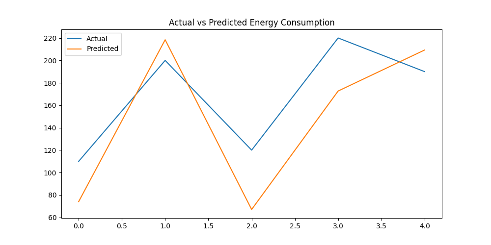

# ⚡ AI-Powered Energy Consumption Forecasting System

## 📌 Overview
This project is an AI-based system that predicts future electricity consumption using Machine Learning. It helps simulate real-world energy forecasting used in smart cities, power grids, and industries.

---

## 🎯 Problem Statement
Energy demand is highly unpredictable, leading to:
- Power wastage
- High electricity costs
- Grid imbalance and blackouts

This project solves this by forecasting energy usage using historical data.

---

## 🚀 Solution
We built a Machine Learning model that:
- Learns patterns from past energy consumption
- Uses time-based features (hour, day)
- Predicts future energy usage
- Provides results via a Flask API

---

## 🧠 Tech Stack
- Python
- Pandas
- NumPy
- Matplotlib
- Scikit-learn (MLP Regressor)
- Flask
- Joblib

---

## 📂 Project Structure

```
AI-Energy-Forecasting/
│
├── data/                     # Dataset
├── models/                   # Saved ML model
├── outputs/                  # Graphs & predictions
├── images/                   # Screenshots
├── src/                      # Code files
├── main.py                   # Training script
├── app.py                    # Flask API
├── test_api.py               # API testing
├── requirements.txt
└── README.md
```

---

## 📊 Features
✔ Energy consumption forecasting  
✔ Machine learning model training  
✔ Data visualization  
✔ Prediction API using Flask  
✔ Real-world simulation  

---

## ⚙️ Installation

### 1. Clone repository
```bash
git clone <your_repo_link>
cd AI-Energy-Forecasting
```

### 2. Create virtual environment
```bash
python -m venv venv
venv\Scripts\activate   # Windows
```

### 3. Install dependencies
```bash
pip install -r requirements.txt
```

---

## ▶️ Usage

### Run training
```bash
python main.py
```

### Run API
```bash
python app.py
```

### Test API
```bash
python test_api.py
```

---

## 📈 Results

### 🔹 Actual vs Predicted Graph
(Add your image here)
```

```

---

### 🔹 Sample Predictions
(Add CSV preview)

---

## 🌍 Industry Relevance
This project is useful in:
- Smart Cities
- Electricity Boards
- Data Centers
- Manufacturing Plants
- Renewable Energy Systems

---

## 🧪 Model Details
- Model: Multi-Layer Perceptron (MLP)
- Input Features: Hour, Day
- Output: Energy Consumption
- Metric: Mean Absolute Error (MAE)

---

## 📡 API Example

### Endpoint:
```
POST /predict
```

### Input:
```json
{
  "hour": 14,
  "day": 2
}
```

### Output:
```json
{
  "energy": 116.63
}
```

---

## 📸 Screenshots
(Add images in /images folder)

---

## 🎓 Learning Outcomes
- Time-series forecasting basics
- Feature engineering
- Model training & evaluation
- API deployment using Flask
- End-to-end ML project development

---

## 👩‍💻 Author
Your Name

---

## ⭐ Future Improvements
- Add weather data
- Use LSTM model
- Build dashboard (Streamlit)
- Improve accuracy
